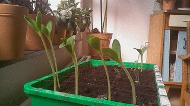

# Picamera Zeitraffer-Aufnahmen  :movie_camera:

## :squirrel: Was macht dieses Programm ?
 Mit dem Programm lassen sich mit dem Raspberry Pi und dem Kamera-Modul einfach Zeitrafferaufnamen erstellen. Der Code basiert weitesgehend auf der offiziellen Dokumentation des Kamera-Moduls [Picamera Docs](https://picamera.readthedocs.io/)

 Die einzelnen Funktion sind umfangreich kommentiert, damit auch EinsteigerInnen (hoffentlich) nachvollziehen können, was der Code bewirkt.

## :water_buffalo: Was brauche ich?
 - Raspberry Pi (egal welches Modell)
 - Raspberry Pi Kamera-Modul (egal welches Modell, sollte auch mit auch mit der Infrarot-Kamera Pi Noir Camera laufen)
 - Raspbian oder ein anderes Betriebssystem mit Python 3

## :whale2: Welches Vorwissen brauche ich ?
Du benötigst keine Programmierkenntnisse. Allerdings wirst du es etwas leichter haben, wenn du dich ein bisschen mit dem Raspberry Pi und seinem Betriebssystem auskennst. Und du solltest Wissen, was ein Texteditor ist und wie du damit eine Datei veränderst.
